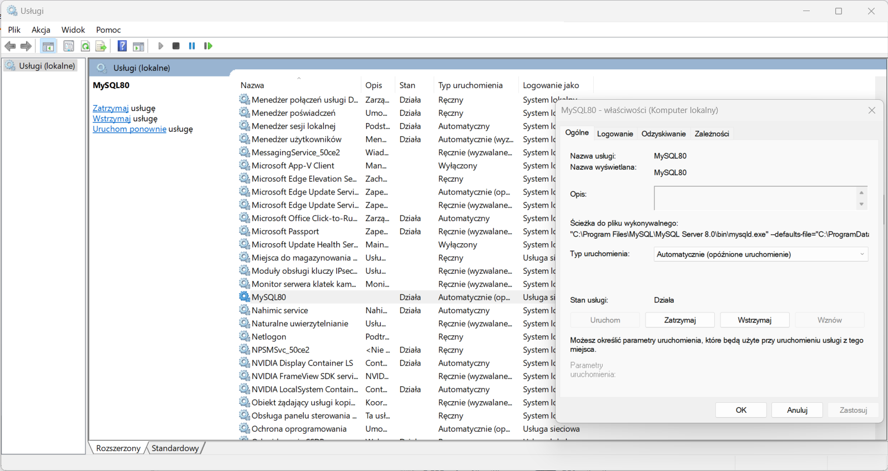
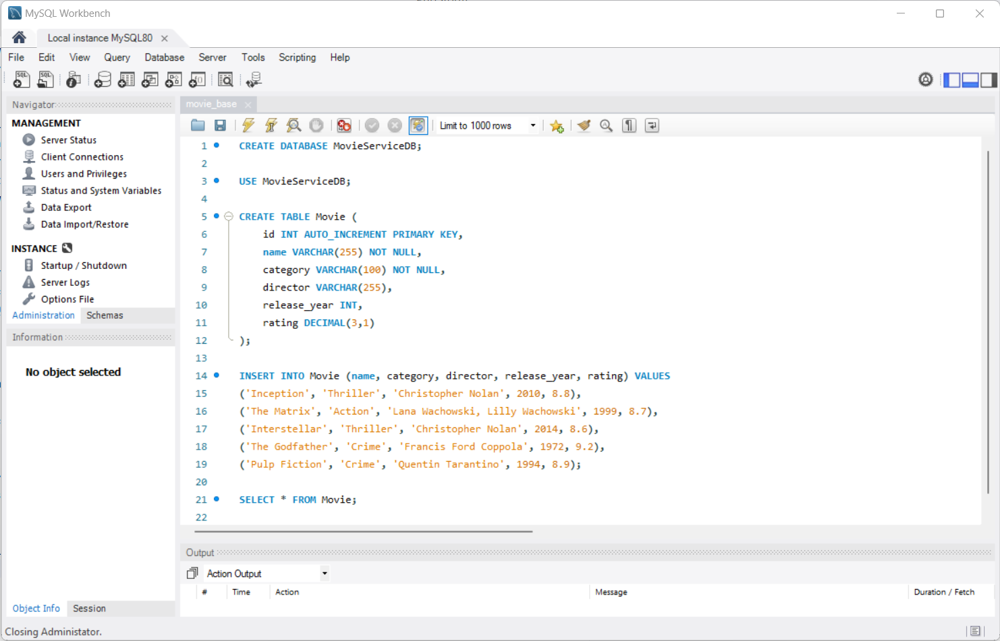
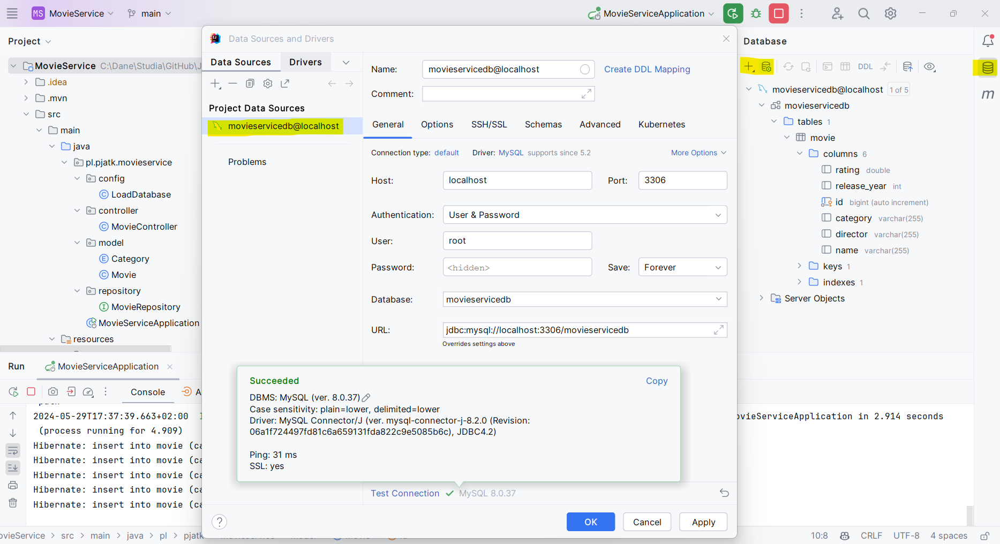

# Ustawienia bazy MySQL
## Java zaawansowana

> [!NOTE]
> ### Instalacja MySql

### [MySQL Installer](https://dev.mysql.com/downloads/installer/)
- wybrać mniejszy plik (2.1M)
- wybrać `No thanks, just start my download.`
- **Choosing a Setup Type**: `Custom`:
  - MySQL Servers (wybrać najnowszy);
  - Application \ MySQL Workbench (wybrać najnowszy)
- Next \ Execute
- Group Replication
  - Standalone MySQL Server / Classic MySQL Replication
- Type and Networking
  - Config Type: Development Computer
- Authentication Method
  - Use Strong Password Encryption for Authentication
- Account and Rules
  - podać wymyślone hasło
- Windows Service
  - [x] Configure MySQL Server as a Windows Service
    - Windows Service Name: `MySQL80` 
  - [x] Start the SQL Server at System Startup

  **services.msc**

- Standard System Account

### MySQL Workbench

Uruchomić program MySQL Workbench 

Welcome to MySQL Workbench
 - MySQL Connections
   - Local Instance MySQL80
   - Wpisać hasło
   - File \ Open SQLScript \ `Wybrać bazę MySQL`

### Intellij IDEA

