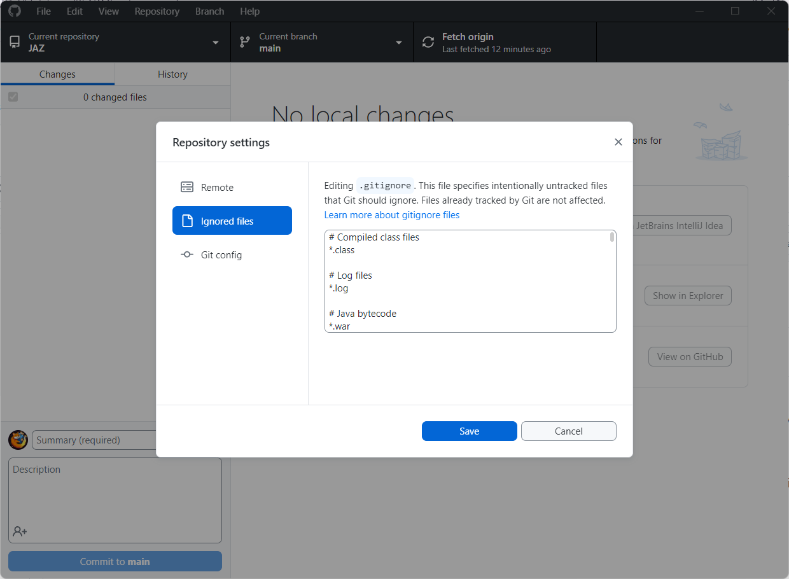

# Pliki i katalogi Spring Boot

## Projekt Spring Boot z Maven

W projekcie Maven w Spring Boot generowane są pliki i katalogi, które mają swoje specyficzne role i znaczenie. 
Poniżej przegląd kluczowych elementów generowanych w typowym projekcie Maven z infografiką określającą czy powinniśmy te rzeczy wrzucać do repozytorium:

✅ Plik `pom.xml` 
- Jest to podstawowy plik konfiguracyjny dla Mavena, określający zależności projektu, pluginy, wersje i inne konfiguracje niezbędne do budowania projektu.

✅ Katalog `src/main/java` 
- Zawiera główne źródła kodu aplikacji, w tym klasy Java.

✅ Katalog `src/main/resources` 
- Przechowuje zasoby projektu, takie jak pliki konfiguracyjne aplikacji (application.properties lub application.yml), oraz inne zasoby niezbędne do działania aplikacji.

✅ Katalog `src/test/java` 
- Zawiera kod źródłowy testów jednostkowych i integracyjnych.

✅ Katalog `src/test/resources` 
- Przechowuje zasoby wykorzystywane podczas testowania, np. pliki konfiguracyjne specyficzne dla testów.

⛔ Katalog `target` 
- Generowany przez Mavena podczas budowania projektu, zawiera skompilowane klasy, zbudowany pakiet aplikacji (np. JAR lub WAR) oraz inne artefakty wynikowe.

⛔ Pliki konfiguracyjne IDE 
- Takie jak `.idea` (dla IntelliJ IDEA), `.project`, `.classpath` (dla Eclipse) – 
są to pliki specyficzne dla środowiska deweloperskiego i zazwyczaj nie są potrzebne innym programistom pracującym nad projektem.

⛔ Pliki logów 
- Generowane podczas działania aplikacji, nie powinny być włączane do repozytorium z powodów bezpieczeństwa i porządkowych.

❔ Katalog `.mvn` 
- Zawiera konfigurację specyficzną dla Maven Wrappera, umożliwiającą uruchomienie zbudowanej aplikacji bez potrzeby instalowania Mavena. 
W praktyce każdy programista ma u siebie Mavena, więc umieszczenie tego katalogu często nie ma sensu. 
Można przypuszczać, że wrapper pozwala zbudować projekt zawsze we właściwej wersji, jednak Maven jest kompatybilny wstecz. 
Czasem zostawia się go z uwagi na konfiguracje CI/CD, jednak jest to również część dyskusyjna.

❔ Pliki `mvnw` i `mvnw.cmd` 
- są skryptami uruchamiającymi, które korzystają z konfiguracji zawartej w katalogu .mvn. 
Bez tych skryptów katalog .mvn sam w sobie nie ma dużej użyteczności, 
ponieważ to właśnie mvnw (dla systemów Unix-like) i mvnw.cmd (dla Windows) umożliwiają wykorzystanie konfiguracji i narzędzi zawartych w .mvn.

## Projekt Spring Boot z Gradle

W projekcie Gradle w Spring Boot, podobnie jak w Maven, generowane są różne pliki i katalogi, które służą określonym celom. 
Oto przegląd kluczowych elementów generowanych w typowym projekcie Gradle w Spring Boot z informacją czy powinny one zawierać się w repozytorium kodu:

✅ Plik `build.gradle` (dla Gradle Groovy) lub `build.gradle.kts` (dla Gradle Kotlin) 
- Podstawowy plik konfiguracyjny dla Gradle, określający zależności, pluginy, wersje i inne konfiguracje niezbędne do budowania projektu.

✅ Katalog `src/main/java` 
- Zawiera główne źródła kodu aplikacji, w tym klasy Java lub Kotlin.

✅ Katalog `src/main/resources` 
- Przechowuje zasoby projektu, takie jak pliki konfiguracyjne aplikacji (application.properties lub application.yml), oraz inne zasoby niezbędne do działania aplikacji.

✅ Katalog `src/test/java` 
- Zawiera kod źródłowy testów jednostkowych i integracyjnych.

✅ Katalog `src/test/resources` 
- Przechowuje zasoby wykorzystywane podczas testowania, np. pliki konfiguracyjne specyficzne dla testów.

⛔ Katalog `build` 
- Generowany przez Gradle podczas budowania projektu, zawiera skompilowane klasy, zbudowany pakiet aplikacji (np. JAR) oraz inne artefakty wynikowe.

⛔ Pliki konfiguracyjne IDE – Takie jak `.idea` (dla IntelliJ IDEA), `.project`, `.classpath` (dla Eclipse) 
- są to pliki specyficzne dla środowiska deweloperskiego i zazwyczaj nie są potrzebne innym programistom pracującym nad projektem.

⛔ Pliki logów 
- Generowane podczas działania aplikacji, nie powinny być włączane do repozytorium z powodów bezpieczeństwa i porządkowych.

⛔ Katalog `.gradle` 
- Zawiera tymczasowe pliki generowane przez Gradle podczas budowania aplikacji. 
Zawartość tego katalogu jest specyficzna dla każdej maszyny, na której uruchamiany jest build, dlatego nie powinien być on włączany do repozytorium kodu.

❔ Plik `gradlew` i `gradlew.bat` oraz katalog `gradle` 
- Pliki te są częścią Gradle Wrappera, który umożliwia uruchomienie budowania projektu bez konieczności instalowania Gradle. 
Umożliwiają one uruchomienie projektu z określoną wersją Gradle, co zapewnia większą spójność między środowiskami deweloperskimi. 
W odróżnieniu od Mavena w Gradlu ryzyko braku konpatybilności jest większe.

Inne pliki w projekcie Spring Boot
W projekcie Spring Boot, niezależnie od używanego systemu budowania, często pojawiają się różne dodatkowe pliki i katalogi, 
które odgrywają kluczowe role. Oto przegląd najbardziej popularnych, które często towarzyszą projektom napisanych w Spring Boot:

❔`.gitignore` 
- Plik konfiguracyjny dla Git, który określa, które pliki i katalogi powinny być ignorowane przez system kontroli wersji. 
Osobiście jestem zdania, że najbardziej ogólny i uniwersalny plik .gitignore powinien znajdować się w repozytorium. 
Jednak każdy programista powinien posiadać lokalnie zdefiniowany własny plik .gitignore, 
który będzie uwzględniał jego system operacyjny, środowisko programistyczne (IDE) 
oraz inne narzędzia specyficzne dla jego środowiska pracy, aby zapewnić optymalne działanie projektu w różnych konfiguracjach.

❔ `README.md` 
- Plik Markdown zawierający podstawowe informacje o projekcie.

✅ `Dockerfile` 
- Plik konfiguracyjny używany do tworzenia obrazów Docker dla aplikacji.

✅ `docker-compose.yml` 
- Plik konfiguracyjny Docker Compose.

⛔ `node_modules` 
- Katalog zawierający pakiety Node.js.

✅ `src/main/resources/static` lub `src/main/resources/templates` 
- Katalogi zawierające zasoby statyczne lub szablony widoków.

❔ `.env` 
- Plik zawierający zmienne środowiskowe i jego dodanie jest zależne od zasady działania naszego projektu. Warto tutaj uważać.

O czym na koniec warto pamiętać?
Ten zestaw zasad stanowi solidny punkt wyjścia dla każdego, kto zarządza repozytorium. 
Pamiętaj jednak, że zawartość repozytorium często jest kwestią umowy i zależy od specyfiki projektu. 
Ważne jest, aby mieć jasno spisane reguły dotyczące tego, co znajduje się w repozytorium, aby utrzymać projekt w dobrej kondycji.

Przykład zdefiniowania `.gitignore`.
Przygotowałem startowy plik .gitignore, który możesz wykorzystać w swoim projekcie, aby zapobiec przypadkowemu dodaniu niepożądanych plików:

```.gitignore
# Compiled class files
*.class

# Log files
*.log

# Java bytecode
*.war
*.nar
*.ear
*.zip
*.tar.gz
*.rar

# Maven directory
target/

# Gradle directory
build/

# Temporary files
*.tmp
*.bak
*.swp

# IntelliJ IDEA files
.idea/
*.iml
*.iws

# Eclipse files
.classpath
.project
.settings/

# NetBeans files
/nbproject/private/
/build/
/nbbuild/
/dist/
/nbdist/
/.nb-gradle/

# VS Code files
.vscode/

# Node modules (if using Node.js within the project)
node_modules/

# Package lock files (if using npm/Yarn for frontend dependencies)
package-lock.json
yarn.lock

# Environment variables file
.env

# Local configuration file (for example, for database)
*.local.*

# Mac OS folder attributes
.DS_Store

# Thumbnails
._*

# Files that might appear in the root of a Spring Boot project
!.mvn/wrapper/maven-wrapper.jar
!gradlew
!gradlew.bat
!gradle/wrapper/gradle-wrapper.properties

```
[Źródło ze strony: Czego Nie Dodawać Do Repozytorium Java/Spring: Najczęstsze Błędy!](https://bykowski.pl/czego-nie-dodawac-do-repozytorium-java-spring-najczestsze-bledy/)

## Konfiguracja `.gitignore` w aplikacji Github Desktop: 

*Wybrać:*
Repository \ Repository settings:


