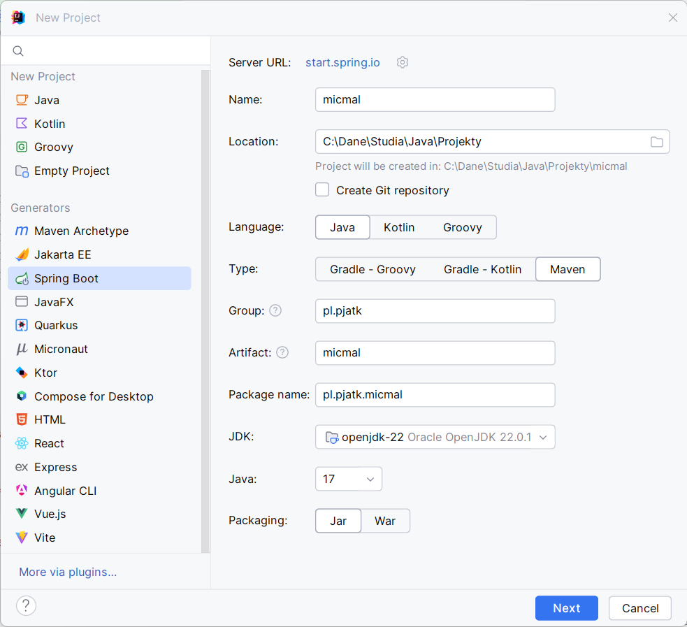
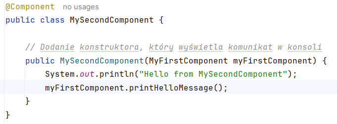
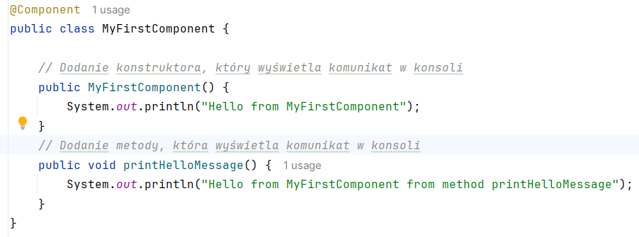
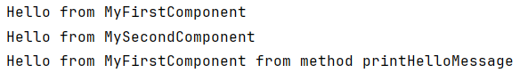
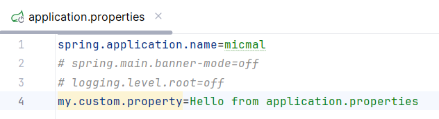
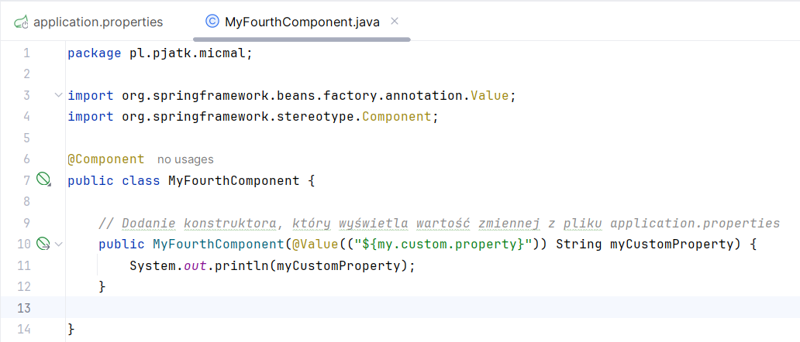

## Zjazd 1 

### Ćwiczenie 1 
1. Stwórz nowy projekt za pomocą https://start.spring.io/. 
Ustaw w nim grupę jako **pl.pjatk**, artefakt jako **3 pierwsze litery swojego imienia** oraz **3 pierwsze litery swojego nazwiska**. 
Wersja javy niech będzie najwyższa jaką masz (preferowana 11 lub wyżej). 



2. Stwórz dwie klasy oznaczone adnotacją `@Component`,

- przykład:
```java
MyFirstComponent
MySecondComponent
```

- a następnie stwórz pomiędzy nimi relację poprzez wykorzystanie odpowiedniego konstruktora. 

> [!TIP]
> W klasie MySecondController w konstruktorze dodaj nowy argument - MyFirstComponent, aby wyłołać z niego metodę.
> 
> 
>

> [!TIP]
> Dodana metoda w MyFirstComponent:
> 
> 
> 

3. Wypisz na ekran nazwy obydwu komponentów. 

> [!NOTE]
> 
> 
> 
 
### Ćwiczenie 2
1. Do poprzednich dwóch klas dodaj po jednej metodzie która wypisze na ekran wiadomość z nazwą komponentu i nazwą metody. 
2. Dodaj nowy komponent któremu wstrzykniesz `ApplicationContext`. 
Następnie poprzez wykorzystanie metody `.getBean(String name, Class componentClass)` z applicationContext utwórz dwa obiekty komponentów które wcześniej utworzyliśmy. 
3. Wywołaj utworzone wcześniej metody. 

### Ćwiczenie 3 
1. Przekształć poprzednią implementację tak aby nie używać adnotacji `@Component` tylko skorzystać z konfiguracji plikami `.xml`. 

### Ćwiczenie 4 
1. Stwórz nową klasę która będzie zwykłym `POJO (Plain Old Java Object)` z kilkoma dowolnymi polami.
2. Stwórz klasę oznaczoną adnotacją `@Configuration` i następnie stwórz beana z wcześniej utworzonej klasy.
3. Stwórz jeszcze jednego beana który będzie nazywał się `defaultData` i będzie zwracał listę String z 5 dowolnymi stringami. 

### Ćwiczenie 5 
1. W pliku `application.properties` dodaj pole `my.custom.property` które przyjmie wartość `Hello from application properties`.

> [!NOTE]
>
> 
>

2. Wypisz tę wartość w konsoli podczas tworzenia dowolnego beana. 

> [!NOTE]
>
> 
> 
> 
> 

### Ćwiczenie 6 
1. Ustaw domyślną wartość w przypadku braku pola w `application.properties`.
2. Wypisz w konsoli domyślną wartość. 

### Ćwiczenie 7
1. Zmień plik z formatu `application.properties` na format `application.yml`. 

## Praca domowa
1. W pliku `application.properties` (lub `application.yml`) stwórz własną zmienną która domyślnie przyjmie wartość `false`. 
Utwórz dodatkowo profil, który zmieni wartość tej zmiennej na `true`.
2. Utwórz bean’a który będzie inicjował się tylko wtedy gdy uruchomisz aplikację z profilem, który w tej zmiennej posiada wartość `true`. 
W przypadku profilu który zostawiał zmienną z wartością `false` bean nie może się utworzyć. 
