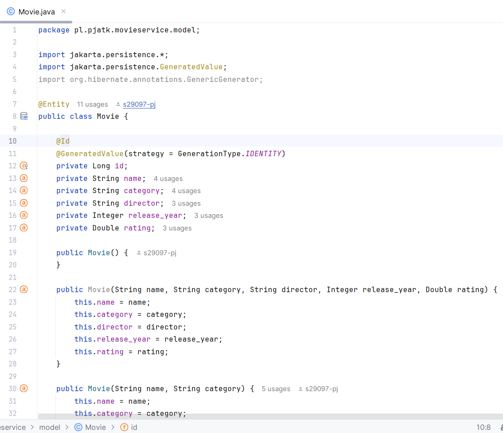
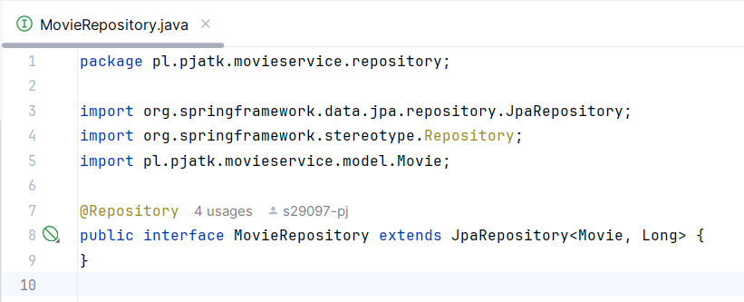
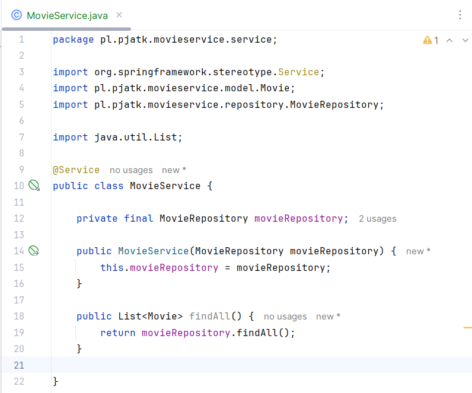
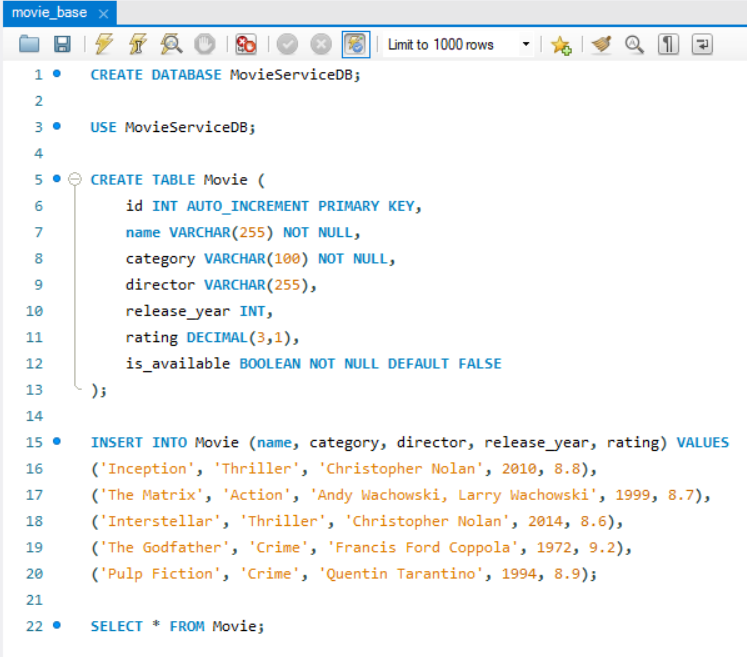
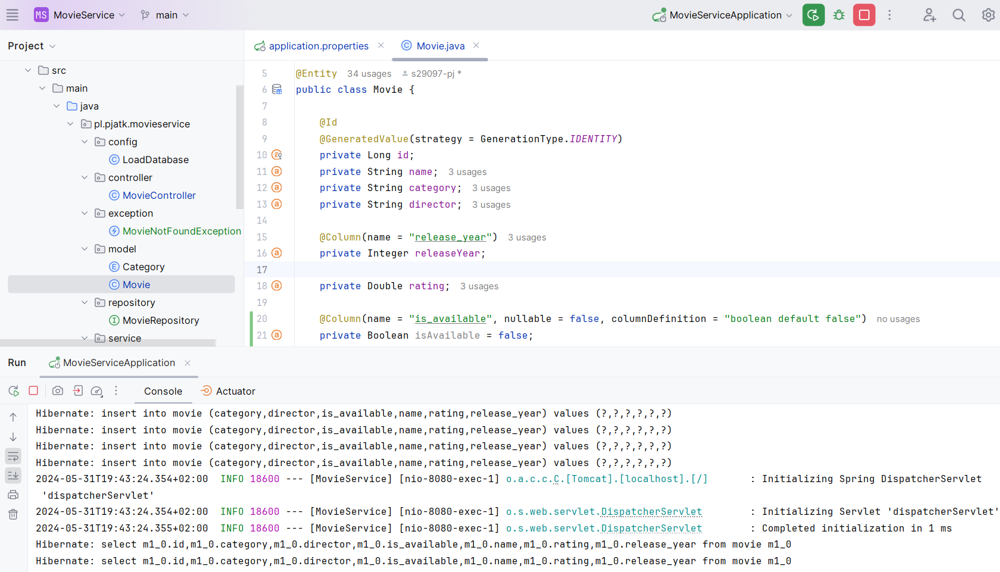
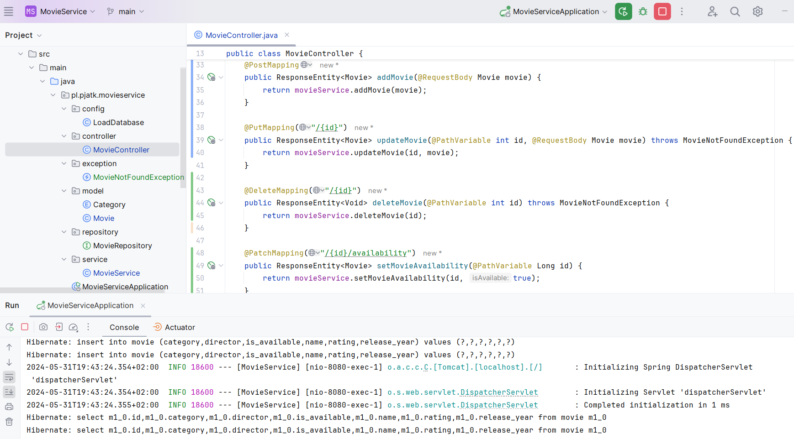
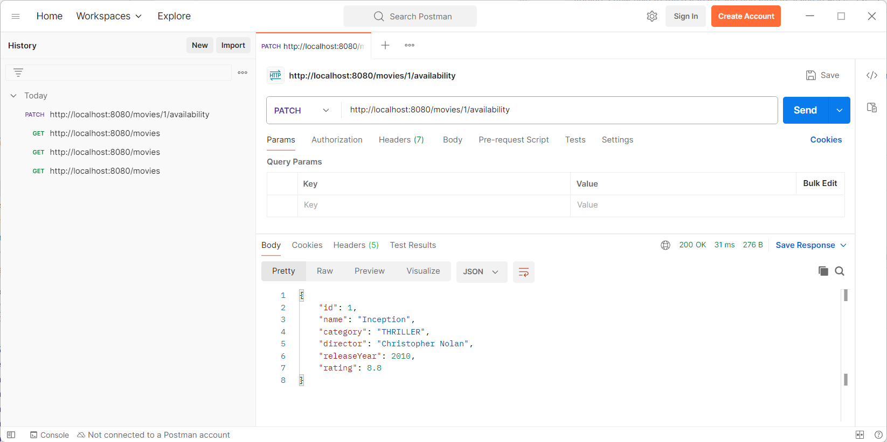

## Zjazd 5 

### Ćwiczenie 1 
1. Dodaj do projektu `dependencje` potrzebne, aby połączyć się z bazą danych przesłaną na kanale teams
(lub lokalną bazą MySQL).

- zawartość pliku `pom.xml` z odpowiednią dependencją:
```java
<dependency>
   <groupId>com.mysql</groupId>
   <artifactId>mysql-connector-j</artifactId>
   <scope>runtime</scope>
</dependency>
```

2. Zaktualizuj plik `application.properties/application.yml`.

- zawartość pliku `application.properties`:
```java
# Nazwa aplikacji Spring Boot
spring.application.name=MovieService

# URL do lokalnej bazy danych MySQL
spring.datasource.url=jdbc:mysql://localhost:3306/movieservicedb

# Nazwa użytkownika do połączenia z bazą danych
spring.datasource.username=root

# Hasło do połączenia z bazą danych
spring.datasource.password=Qwerty12

# Strategia Hibernate dla DDL (Data Definition Language)
# 'validate' - sprawdza zgodność schematu bazy danych z mapowaniem encji podczas startu
spring.jpa.hibernate.ddl-auto=validate

# Opcja pokazująca zapytania SQL generowane przez Hibernate w konsoli
spring.jpa.show-sql=true
```

### Ćwiczenie 2
1. Oznacz klasę `Movie` adnotacjami potrzebnymi do połączenia jej z tabelą z bazy danych.

- Adnotacja `@Entity` na poziomie klasy informuje Springa, że ta klasa reprezentuje encję, 
która jest mapowana na tabelę bazy danych.  
- Adnotacja `@Id` oznacza pole, które jest kluczem głównym w tabeli bazy danych.  
- Adnotacja `@GeneratedValue` z strategią `GenerationType.IDENTITY` 
informuje, że wartość tego pola jest generowana automatycznie przez bazę danych.  

Oto fragment kodu, który to realizuje:



### Ćwiczenie 3 
1. Dodaj interfejs rozszerzający `JpaRepository`.

- interfejs `MovieRepository` rozszerza `JpaRepository`:



2. Przepisz `MovieService` tak, aby od teraz wykorzystywał dane dostarczane z bazy danych.

- `MovieService` korzysta z `MovieRepository` do pobierania danych z bazy danych 
poprzez wstrzykiwanie zależności w konstruktorze, a metoda `findAll()`z MovieRepository 
do pobrania wszystkich filmów. 

Oto fragment kodu, który to realizuje:



## Praca domowa
1. Zapoznaj się ze springowymi [Query Methods](https://docs.spring.io/spring-data/jpa/reference/jpa/query-methods.html).
2. Dodaj do bazy danych nowe pole typu `boolean` o nazwie `is_available`.
   - Niech ono będzie typu `non-null`, oraz niech zawiera domyślną wartość `false`.



  - Dodaj je również po stronie javy.

W klasie `Movie` w pliku `src/main/java/pl/pjatk/movieservice/model/Movie.java`, 
dodałem pole `isAvailable` z adnotacją `@Column`, która określa, że pole nie może być `null (nullable = false)` 
i ma domyślną wartość `false (columnDefinition = "boolean default false")`.



5. Dodaj nowy `endpoint`, który będzie JEDYNIE zmieniał wartość tego pola na `true`.

W klasie `MovieController` w pliku `src/main/java/pl/pjatk/movieservice/controller/MovieController.java`, 
dodałem metodę `setMovieAvailability`, która obsługuje żądania `PATCH` na adres `/movies/{id}/availability`. 
Ta metoda ustawia wartość `isAvailable` na `true` dla filmu o podanym `ID`.



Aby przetestować ten endpoint w Postmanie, wykonałem następujące kroki:  
1. Otwarłem Postmana.
2. Wybrałem `PATCH` z rozwijanego menu.
3. Wprowadziłe URL endpointu, 
- http://localhost:8080/movies/1/availability ,
gdzie 1 to ID filmu, którego dostępność chciałem zmienić.

4. Kliknąłem `Send`.

Po wysłaniu żądania, wartość `isAvailable` dla filmu o podanym ID została zmieniona na `true`.


