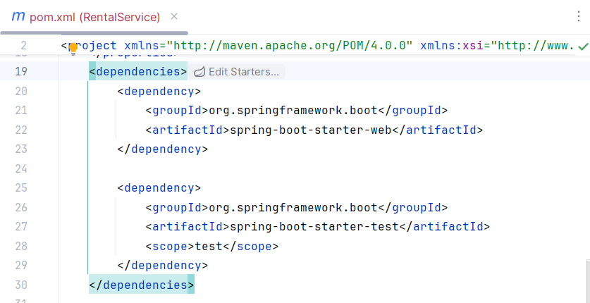
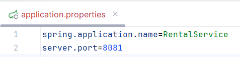
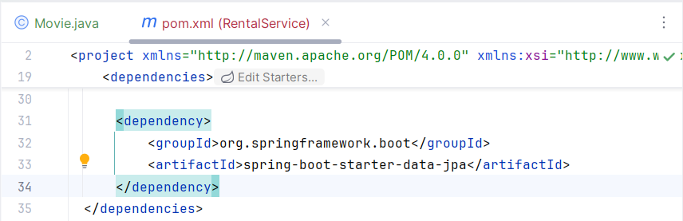
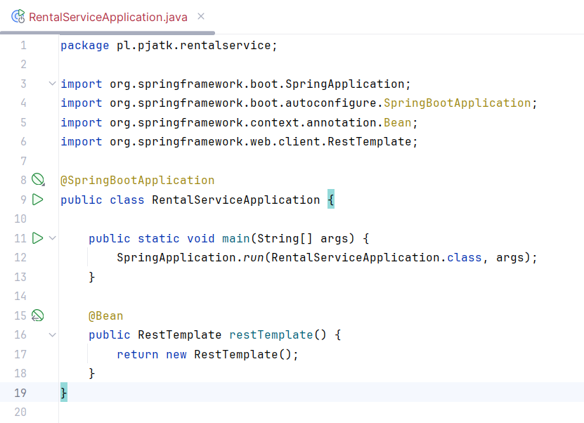

## Zjazd 6 

### Ćwiczenie 1 
1. Stwórz nowy projekt, który będzie nazywał się `RentalService`.
   - Skorzystaj tylko z dependecji `spring-boot-starter-web` oraz `spring-boot-starter-test`.



2. Zmień domyślny port aplikacji na `8081`.



### Ćwiczenie 2
1. Dodaj do projektu dokładnie tak samo wyglądający model `Movie`.

> Skopiowałem tylko klasę `Movie` z poprzedniego projektu do nowego projektu. 
Klasa Movie skopiowałem z `src/main/java/pl/pjatk/movieservice/model/Movie.java.` 
do `package pl.pjatk.rentalservice.model`;

> Dodałem brakującą zależność (dependencję):
```
<dependency>
<groupId>org.springframework.boot</groupId>
<artifactId>spring-boot-starter-data-jpa</artifactId>
</dependency>
```


2. Dodaj `bean` dla obiektu `RestTemplate`.



### Ćwiczenie 3 
1. Stwórz nowy `RestController` oraz `Service` dla dwóch metod.
   - `getMovie(Long id)`: 
     - Powinien wykonać zapytanie po `REST` do `MovieService` 
     - i odwołać się do endpointu szukającego `Movie` po `ID` i zwrócić je użytkownikowi.
   - `returnMovie(Long id)`: 
     - Powinien wykonać zapytanie po `REST` do `MovieService` 
     - i wywołać endpoint, który został napisany w ramach pracy domowej. 
     - Film o podanym ID powinien zmienić wartość pola `is_available` na `true`.

### Ćwiczenie 4
1. W mikroserwisie `MovieService`: 
   - dodaj nowy endpoint, który będzie zmieniał wartość pola `is_available` na `false`.
2. W mikroserwisie `RentalService`: 
   - dodaj nowy endpoint, który będzie wywoływał nowo utworzony endpoint z `MovieService`.
   - `rentMovie(Long id)`: 
     - powinien wykonać zapytanie po `REST` do `MovieService` 
     - i wywołać endpoint, napisany w punkcie `nr 1. Film` o podanym `ID` powinien zmienić wartość pola `is_available` na `false`

## Praca domowa
Do serwisu `RentalService` dodaj obsługę statusów zwróconych przez `MovieService`.
- Jeżeli `MovieService` zwróci `HTTP status 404`, niech `RentalService` też zwróci `404`;
- Jeżeli `MovieService` zwróci `HTTP status 400`, niech `RentalService` też zwróci `400`;
- Jeżeli `MovieService` zwróci `HTTP status 500`, niech `RentalService` zwróci `502`;
- Jeżeli `MovieService` zwróci `ConnectException`, niech `RentalService` zwróci `504`.
